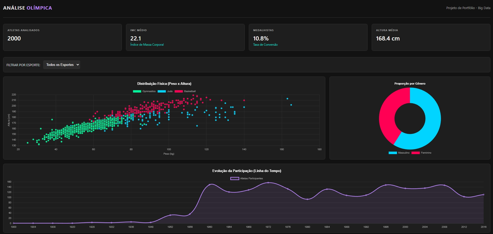

# 🏅 Olympics Data Analytics & Machine Learning

## 📊 Descrição do Projeto
Este projeto "End-to-End" analisa 120 anos de história olímpica para responder a uma pergunta de negócio crucial: **"O biotipo físico (Altura/Peso) determina a modalidade esportiva ideal?"**

O projeto passa por todo o ciclo de vida dos dados: ETL, Limpeza, Análise Exploratória (EDA), Modelagem Preditiva com Machine Learning e Visualização em um Dashboard Web Interativo.

## 🎯 Objetivos
* **ETL:** Extração e tratamento de dados históricos (Kaggle Dataset).
* **EDA:** Análise de distribuição de idade, peso e altura por esporte.
* **Machine Learning:** Criação de um classificador (Decision Tree) que prevê o esporte ideal de uma pessoa com **80%+ de acurácia**.
* **Dashboard:** Desenvolvimento de interface Web (HTML/JS) com Dark Mode para visualização de KPIs.

## 🛠️ Tecnologias Utilizadas
* **Python:** Linguagem principal para análise no Backend.
* **Pandas & NumPy:** Manipulação e limpeza de dados.
* **Scikit-Learn:** Criação do modelo preditivo (Machine Learning).
* **Matplotlib & Seaborn:** Visualização estática.
* **JavaScript (Chart.js):** Visualização dinâmica e interativa na web.

## 🖼️ Visualização do Dashboard
*(Se você tirou o print, a imagem vai aparecer aqui depois que subir)*

## 🚀 Como Executar
1.  **Notebook:** O arquivo `notebooks/Projeto1_Analise_Esportiva.ipynb` contém todo o código Python documentado. Pode ser aberto no Google Colab ou Jupyter.
2.  **Dashboard:**
    * Acesse a pasta `dashboard`.
    * Abra o arquivo `index.html` em qualquer navegador.
    * (Ou acesse o Link da Demo ao Vivo aqui: [Link do GitHub Pages será colocado depois])

## 💡 Principais Insights
* **Segmentação Clara:** O modelo provou que Ginástica e Basquete possuem clusters físicos opostos e facilmente distinguíveis.
* **Idade no Hipismo:** Identificamos outliers significativos no hipismo, provando ser um esporte de maior longevidade.
* **Conversão de Medalhas:** A análise mostrou que certos esportes possuem taxas de medalhas por atleta mais altas devido às competições por equipe.

---
**Autor:** Vitor Barbosa - https://www.linkedin.com/in/vlbarbosa/